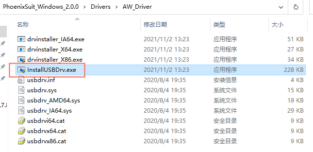
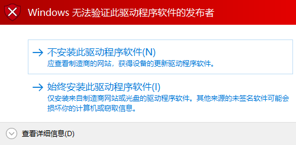
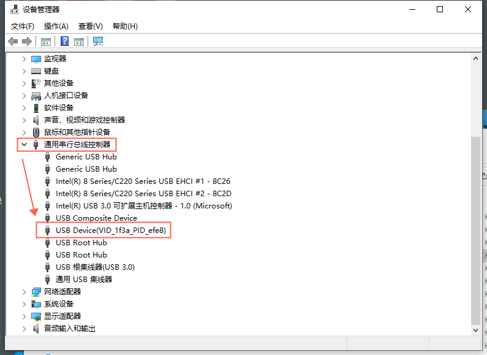

# R128 DevKit 开发板

针对 R128 模组，百问科技推出了 R128 DevKit 开发板作为快速开发评估工具。

特性：

- 板载 R128-S2-N16R16 模组
- 板载 2.4G RF 陶瓷天线
- 板载 USB Type C OTG
- 板载 UART 转 USB 芯片
- 板载 RESET，FEL 下载按键
- 板载 4 颗 WS2812 RGB LED
- 板载 PMU，支持对外供电 3.3V 1A
- 提供 GPIO 37 个，引出 3 路 MIC，2 路 LINEOUT
- 板厚 1.6MM，引出邮票孔

## 资源下载

- 硬件工程开源地址：[https://oshwhub.com/gloomyghost/r128-module](https://oshwhub.com/gloomyghost/r128-module)
- 电路图：[SCH_R128-DevKit_2023-09-05.pdf](https://www.aw-ol.com/downloads?cat=22)
- PCB：[ProDocument_R128-DevKit_2023-09-05.epro](https://www.aw-ol.com/downloads?cat=22)
- GERBER：[Gerber_R128-DevKit_2023-09-05.zip](https://www.aw-ol.com/downloads?cat=22)
- STL：[DXF_R128-DevKit_2023-09-05.dxf](https://www.aw-ol.com/downloads?cat=22)
- 3D STEP：[3D_R128-DevKit_2023-09-05.step](https://www.aw-ol.com/downloads?cat=22)
- BOM：[BOM_R128-DevKit_R128-DevKit_2023-09-05.xlsx](https://www.aw-ol.com/downloads?cat=22)
- 点位图：[PickAndPlace_R128-DevKit_2023-09-05.xlsx](https://www.aw-ol.com/downloads?cat=22)
- USB 转 UART 驱动下载：[CH341SER.EXE](https://www.wch.cn/downloads/CH341SER_EXE.html)

## 购买链接

- [百问科技淘宝店 - 全志R128 DevKit](https://m.tb.cn/h.5T4uATe?tk=S079W0vCt6v)

## 原理图模块介绍

### R128 模组

R128 模组使用 SMT 贴装于 开发板上，外挂陶瓷天线，其中的PA16，PA17脚复用为 UART 调试脚，已经在板上连接了 UART 转 USB 芯片。

### 电源

电源使用 MT3520B 作为主 DCDC 芯片，输入 5V 电压输出 3V3 供 R128 使用，也可以提供给外设模块使用

### USB 转 UART 

USB 转 UART 使用的是 WCH 的 CH340N，最大支持 2M 波特率。

### 按键

板载按键 RESET 与 FEL 两个按键，RESET 按键能重置 R128 模组，FEL 按键能进入下载模式。其中 RESET 按键连接 R128 模组的 EN 脚上，FEL 按键连接到 R128 模组的 PA1 脚上。

### RGB LED 

R128 DevKit 包括4颗 WS2812 灯珠，支持七彩颜色，连接在 R128 模组的 PA13 脚上。

## 烧录测试固件

### 安装烧录软件

前往 [全志在线-资料下载](https://www.aw-ol.com/downloads?cat=5) 页面，选择下载 `AllwinnertechPhoeniSuitRelease20230905.zip` 

将下载的压缩包解压，提取到文件夹中

在文件夹中找到需要的 Windows 版本，同样解压到文件夹中

找到 `PhoenixSuit.exe` 双击打开即可

打开后的软件如下所示

### 安装 USB 驱动

下载程序需要安装上 USB 驱动，驱动位于刚才安装的烧录软件 PhoenixSuit 的 Drivers 目录中：

在这里面可以找到两个驱动，安装 AW_Deiver

运行 `InstallUSBDrv.exe` 即可开始安装

安装过程中提示无法验证此驱动程序软件的发布者点击始终安装即可。

安装完成后，将 DevKit 通过 USB TypeC 线接入电脑，注意需要插入 OTG 口

然后按住 FEL 按键，之后按一下 RESET 按键重置芯片，等待电脑连接后再松开 FEL 按键

连接的 DevKit 可以在 设备管理器-通用串行总线控制器看到设备：`USB Device(VID_1f3a_PID_efe8)`

如果没找到这个设备，但是看到了一个未知设备，请尝试手动安装驱动，详见 [开发环境搭建-Windows 驱动安装](/r128/prepare_dev_env/)

### 获取测试固件

前往 [全志在线-资料下载](https://www.aw-ol.com/downloads?cat=21) 页面找到 R128 固件，选择下载 R128_DevKit_RGB.img

## 烧录测试固件

打开 PhoneixSuit，选择一键刷机，点击浏览，选择下载的 `R128_DevKit_RGB.img` 

这里会显示固件生成的时间

配置烧录选项，选择全盘擦除升级

然后将 DevKit 通过 USB TypeC 线接入电脑，插入 OTG 口

然后按住 FEL 按键，之后按一下 RESET 按键重置芯片，等待电脑连接后再松开 FEL 按键

软件提示开始烧写固件

等待烧写完成即可

提示固件烧写成功

可以看到板载的 RGB LED 灯正常亮起

