# RTOS 使用说明

## 使用串口访问设备


使用USB TypeC 连接线连接开发板 USB转串口 的接口，安装串口驱动程序：[CH341SER.EXE](https://www.wch.cn/download/CH341SER_EXE.html)

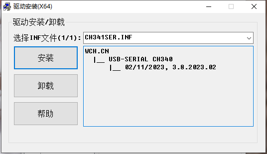

到设备管理器找到需要的串口，这里是 `COM8`


使用串口访问工具 PuTTY 打开串口，这里是 COM8，波特率 115200。


打开之后回车即可访问控制台。

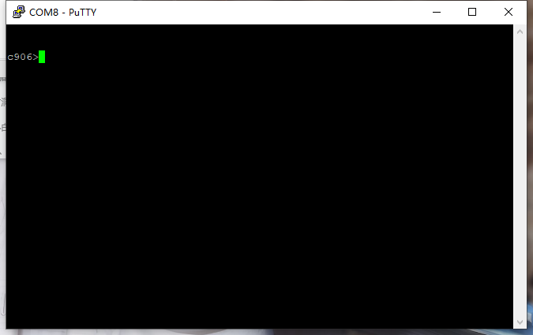

可以输入 `help` 命令查看支持的命令。

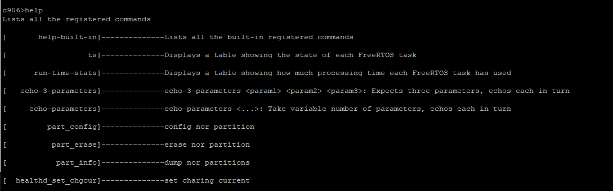

## 查看三个核心运行频率

连接开发板的时候可以点击 RESET 按钮重置 CPU，查看输出。


这里可以看到 M33 核心运行频率 192MHz，DSP 运行频率 400MHz，C906 运行频率 480MHz

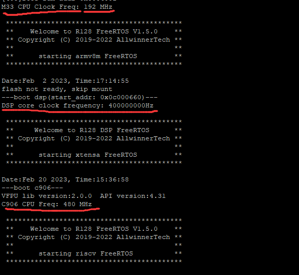

## 系统调试命令

### help

```
help
```

获取系统支持的终端命令


### backtrace

查看指定任务堆栈回溯信息

```
backtrace [taskname | tasknumber]
```

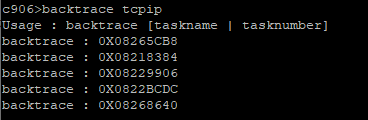

### top

查看系统任务状态

```
top [‑d 2]
```

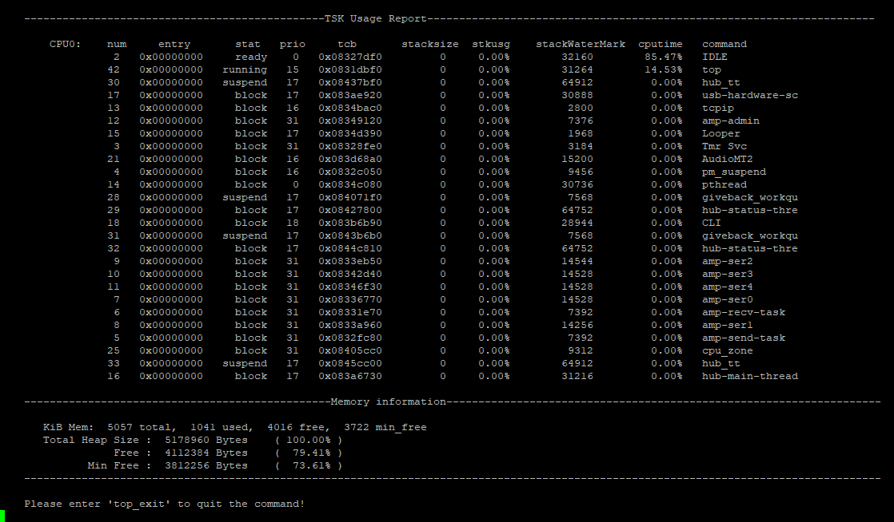

### ts

展示所有FreeRTOS任务的状态

```
ts
```

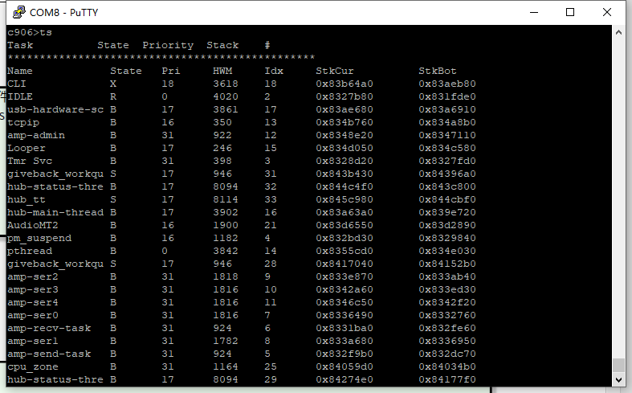

### list_irq

列出所有支持的中断及其状态

````
list_irq
````

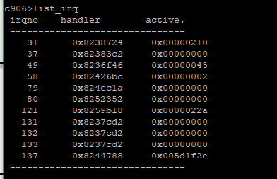

### free

查看系统堆的内存

```
free
```

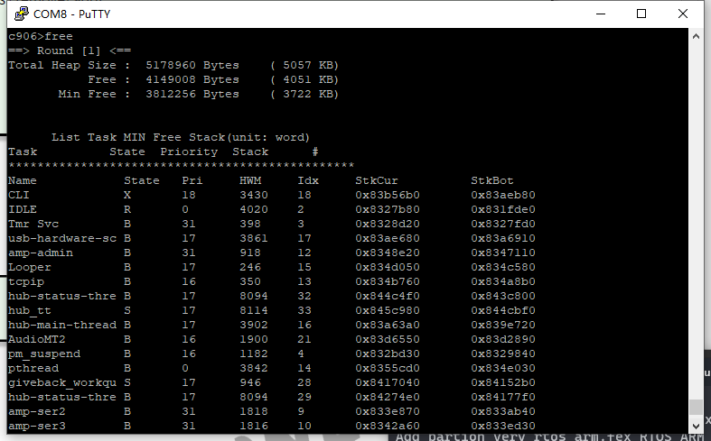

### p

读取地址 `reg_start_addr` 对应长度 `len` 的内容

```
p [reg_start_addr] [len]
```

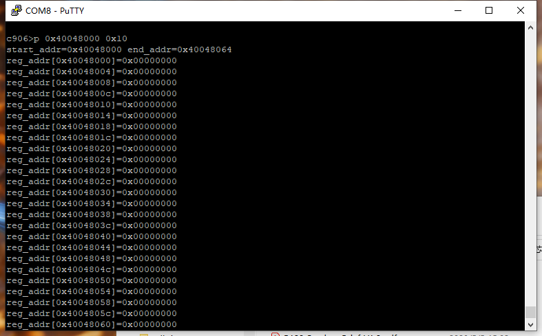

### m

向地址 `reg_address` 写值 `reg_value`

```
m [reg_address] [reg_value]
```

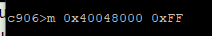

### forkarg

修改fork命令参数，可设置fork命令创建的任务的优先级及其栈大小

```
forkarg [‑p priority] [‑s size]
```

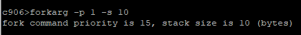

### fork

不占用控制台任务，在后台运行命令

```
fork command [arg1 ...]
```

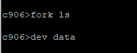

## 文件系统命令

### df

查看文件系统剩余空间

```
df [path]
```

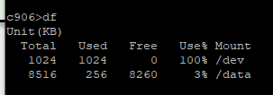

### ls

列出指定文件或者目录信息

```
ls [‑h] [‑l] [‑k] [file1]
```

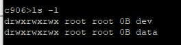

### cat

以ACSII码的形式，读取指定的文件

```
cat <file>
```


### hexdump

查看二进制文件内容

```
hexdump [‑n num] [‑C] file
```

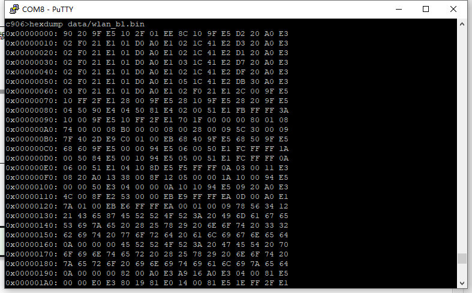

