# RTOS 软件包配置

本文将介绍 RTOS 软件包、地址，内核配置等。

## Kconfig 简介

有过 linux 内核开发经验的人，对 menuconfig 不会陌生。对于各类内核，只要是支持 menuconfig 配置界面，都是使用 Kconfig。

换言之：

- menuconfig：支持配置内核的图形化界面。
- Kconfig：生成 menuconfig 界面的脚本语言。

## menuconfig 操作简介

我们运行 mrtos_menuconfig 之后，会打开如下图所示的界面

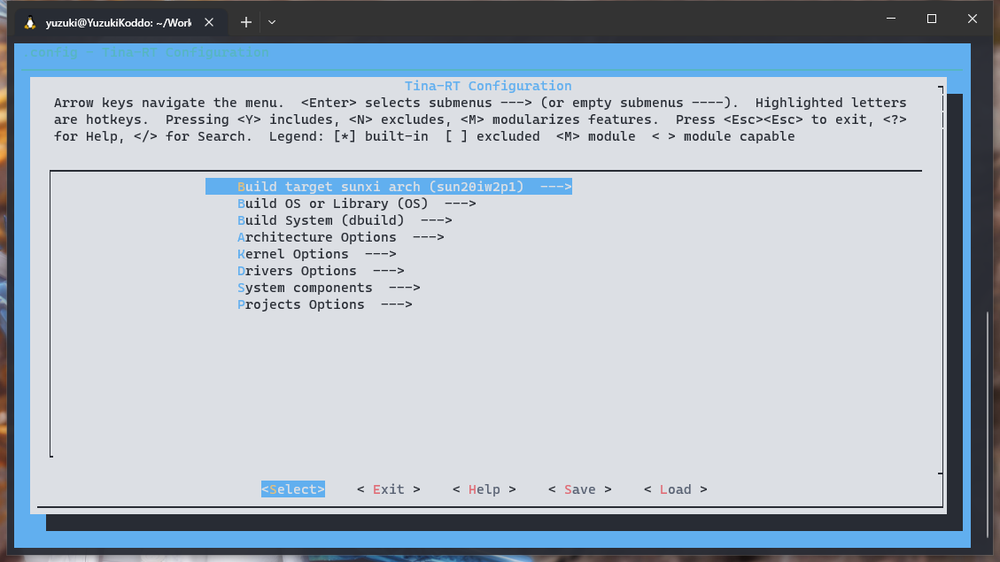

整个显示界面大致分为三部分

上方是操作的说明和图例说明。

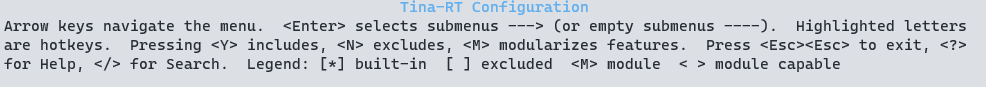

- `<Enter>` 按下Enter键进入子菜单。
- `<Y>` 按下Y键，选中这项功能。
- `<N>` 按下N键，排除这项功能 。
- `<M>` 按下M键，以模块的形式选择。
- `<Esc><Esc>` 按两下Esc键，返回上一级菜单
- `<?>` 按下?键，查看高亮功能的帮助信息
- `` 按下/键，搜索
- `[*]` 被选中的项目
- `[ ]` 未被选择的项目
- `<M>` 以模块形式被选择的项目
- `< >` 未被选择的模块

中间部分就是我们要选择的各项功能了，使用上下两个方向键进行选择，也可以使用关键字进行跳转。

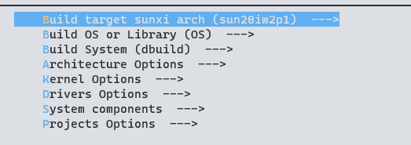

最下方是功能选择按钮，功能与案件基本重合。使用左右方向键选择，Enter键选中。

- `<Select>`进入下级菜单
- `< Exit >` 退回上一级菜单，在最顶层菜单就是退出menuconfig
- `< Help >` 显示当前选项的帮助信息
- `< Save >` 手动保存配置文件
- `< Load >` 加载指定的配置文件，默认加载的是.config

## RTOS menuconfig 说明

了解了menuconfig的基本操作，我们再来了解一下 RTOS 的 menuconfig 具体都有是么内容。

### Build target sunxi arch

分别选择芯片的系列，对于R128平台，使用的是 `sun20iw2p1` 平台

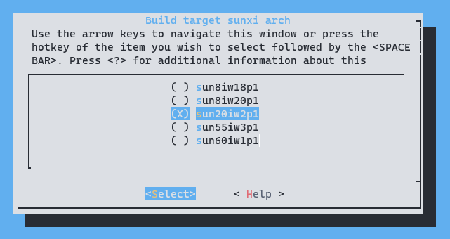

### Build OS or Library

选择编译为 Library 还是 OS，这里我们使用的是 OS 所以设置为编译 OS

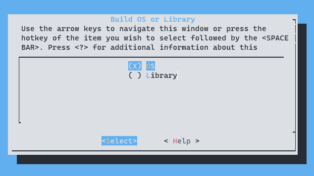

### Build System

这部分配置 RTOS 的配套编译脚手架，配置编译使用的编译工具链的路径，libc的类型等等。

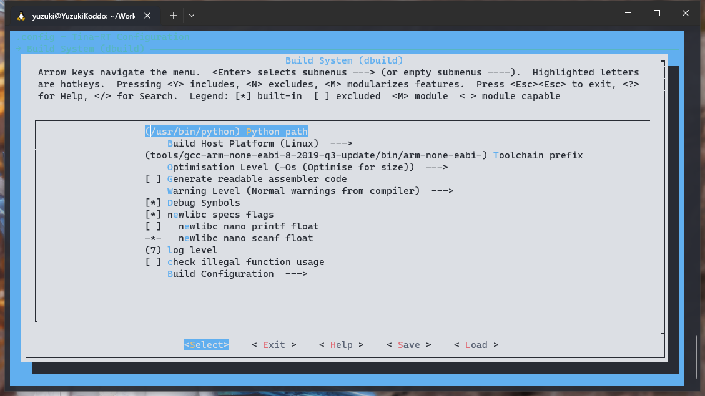

### Architecture Options

架构配置，配置CPU的架构，入口地址，分配的内存长度，RV核心的地址，DSP核心的地址。这里也也配置默认启动的核心，可以关闭 C906 和 DSP 核心的启动。

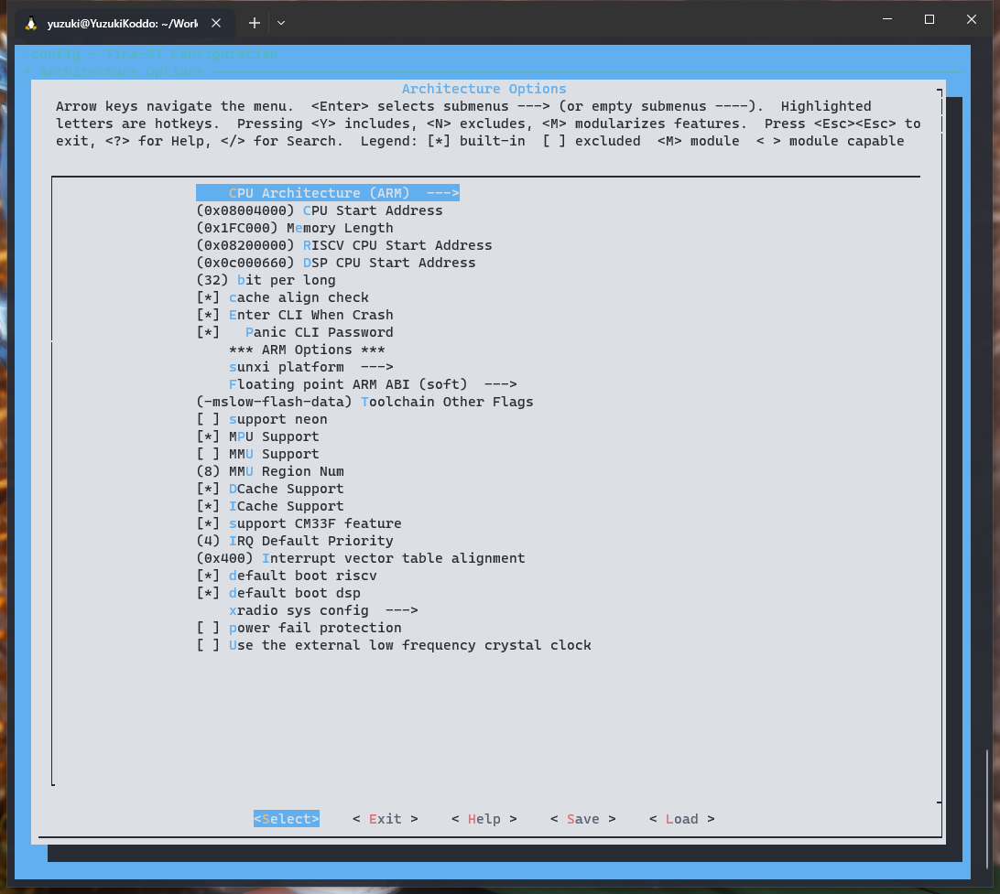

### Kernel Options

FreeRTOS 内核相关的配置，一般不需要修改。

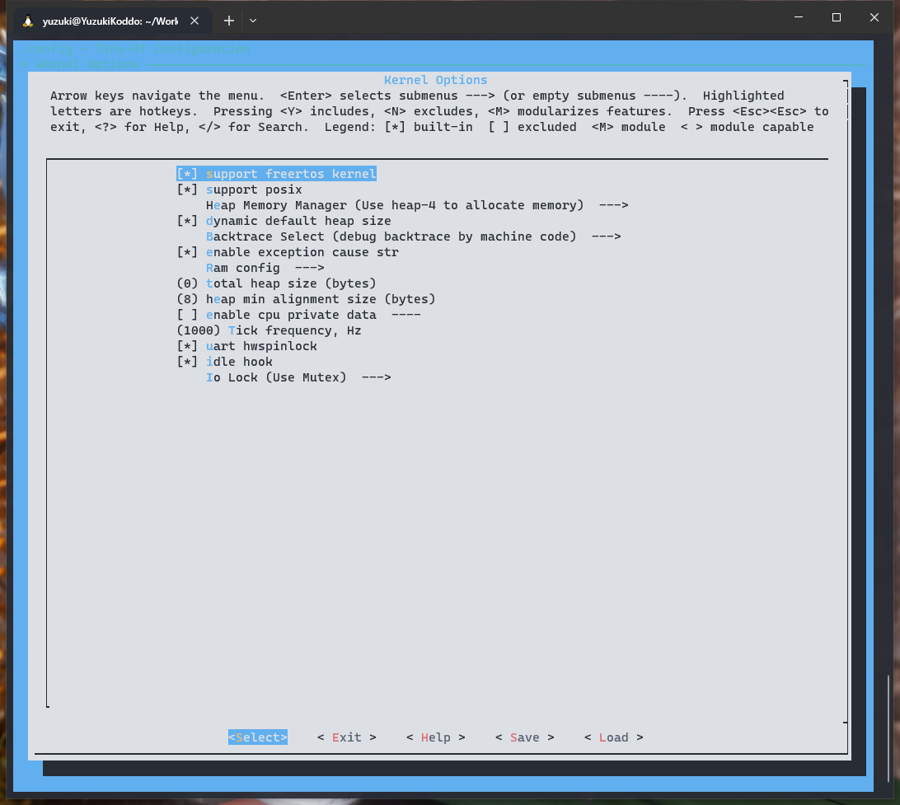

### Drivers Options

驱动配置，分为 `soc related device drivers` 和 `other drivers`

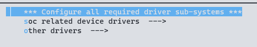

#### soc related device drivers

包括各种外设驱动，与驱动的单元测试。

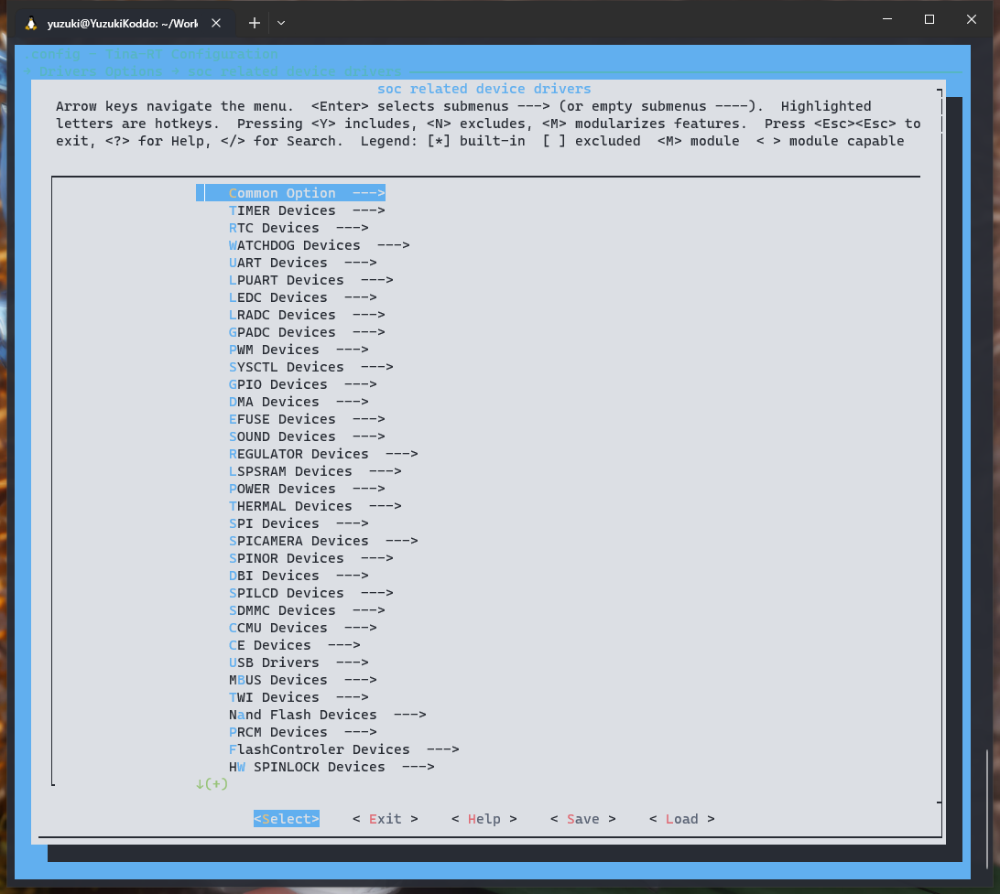

#### other drivers

包括 WiFi 驱动，蓝牙驱动等等

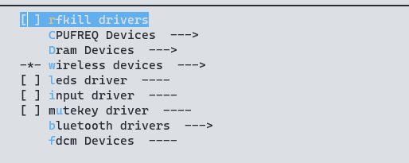

### System components

组件选择，软件包，协议栈等相关选择

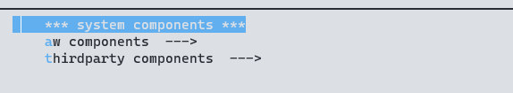

#### aw components

全志提供的相关组件，核间通信组件，多媒体组件等。

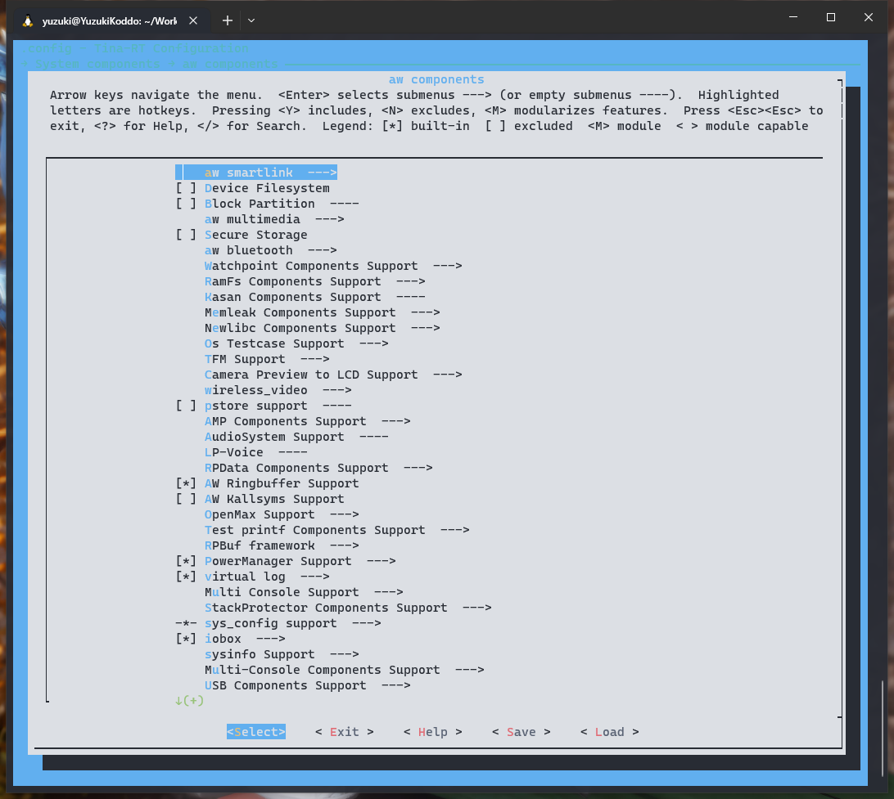

#### thirdparty components

第三方提供的组件，lvgl，协议栈等等

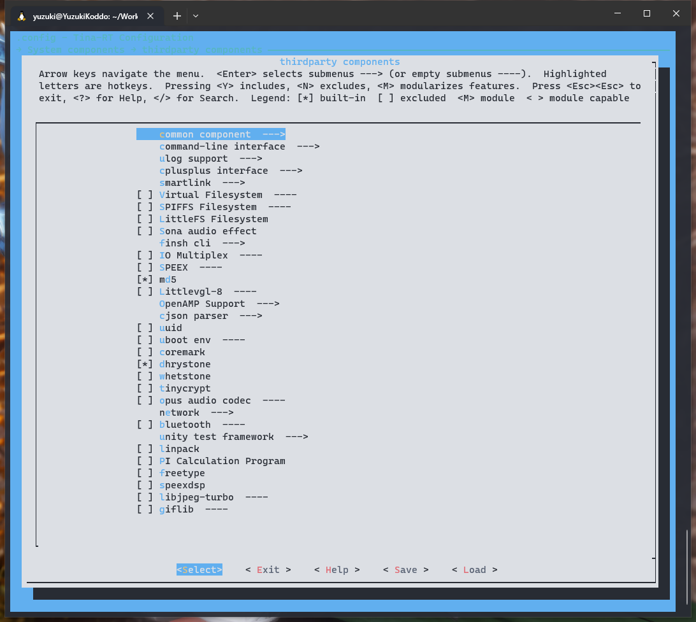

### Projects Options

项目配置，选择项目方案

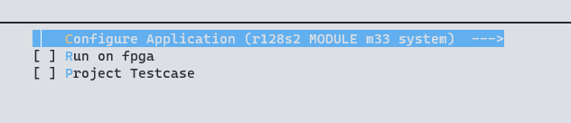

## menuconfig 配置保存

完成配置之后，我们可以选择使用左右方向键选择 **< save >** 并按下Enter键。

如果修改配置文件名称的话，就是将当前的配置另外保存到指定文件；不修改的话默认保存在.config中， 然后选择 **ok** 确认，就可以继续进行配置了修改了。如果不想保存，那么可以按两下 **Esc** 键返回。

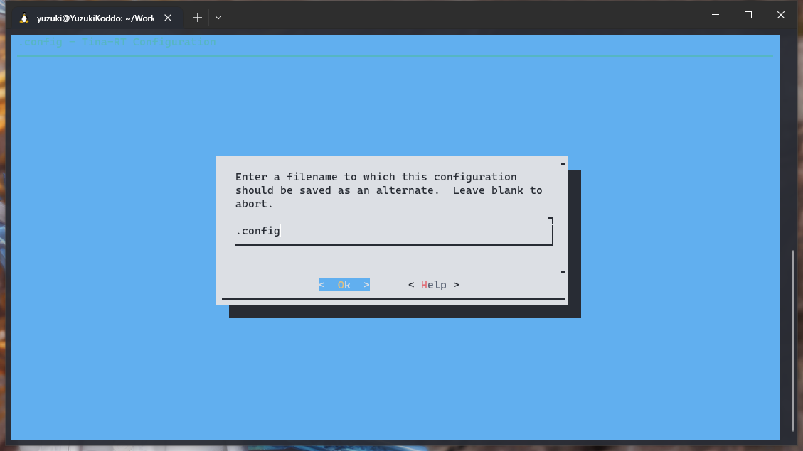

当然也可以不使用上面的操作，在全部修改都完成之后，连按 **Esc** 键，就会退出menuconfig。 在退出时会提醒是否保存配置文件，选择 **Yes** 即可保存配置，如果不想保存可以选择 **No** ， 如果还想继续修改，可以按两下 **Esc** 键返回 menuconfig 继续修改。

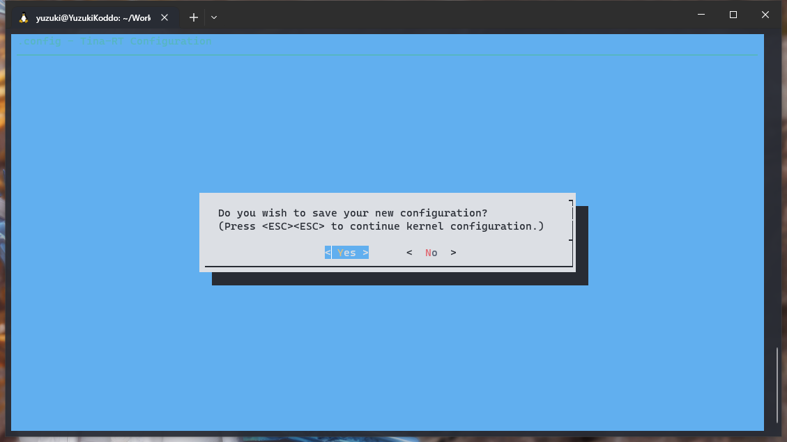

